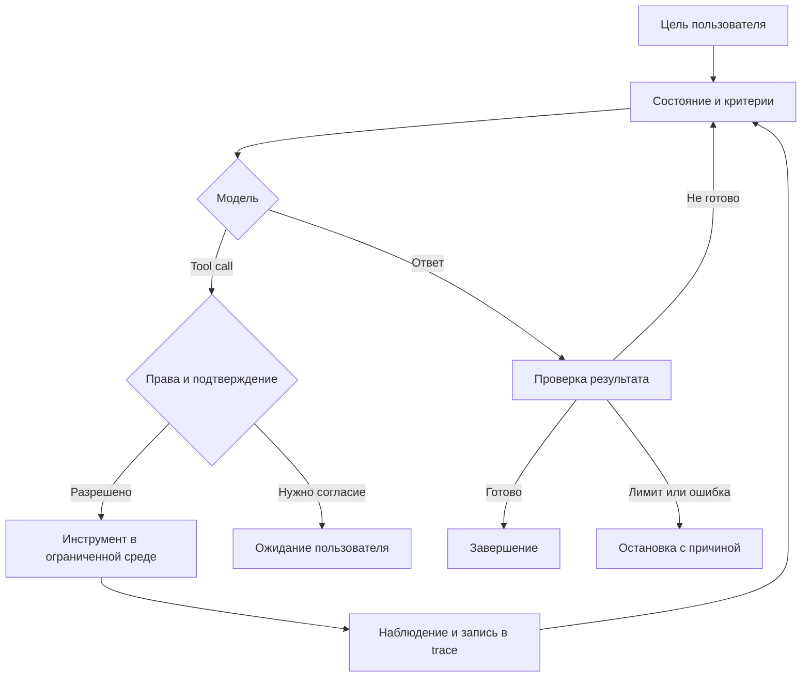

---
tags:
  - agents
  - architecture
  - theory
aliases:
  - Состав агента
  - Agent Anatomy
created: 2026-04-15
updated: 2026-09-11
status: evergreen
---

# Анатомия агента

Рабочий агент — это не одна LLM, а управляемый цикл «решение → действие → наблюдение → проверка». Приложение вокруг модели отвечает за полномочия, состояние, выполнение инструментов и завершение задачи.

## Компоненты

### 1. Цель и контракт результата

До запуска нужны ожидаемый outcome, критерии готовности, ограничения и поведение при нехватке данных. Без них агенту трудно понять, когда остановиться.

### 2. Модель и инструкции

Модель интерпретирует задачу, выбирает следующий шаг и формирует аргументы для tool call. Инструкции задают рабочую политику, но критические ограничения должны дополнительно обеспечиваться кодом и правами среды.

### 3. Оркестратор

Оркестратор управляет циклом:

- передаёт модели состояние и доступные инструменты;
- валидирует структурированный ответ;
- проверяет разрешения перед действием;
- выполняет tool call и возвращает наблюдение;
- обрабатывает retries, таймауты и отмену;
- решает, продолжать, ждать подтверждения или завершить run.

### 4. Инструменты

Инструмент — типизированная операция над внешним миром: поиск, запрос к API, выполнение кода или изменение файла. Его описание должно объяснять назначение, параметры, результат, ошибки и побочные эффекты. См. [[Tool Use Function Calling]].

### 5. Среда выполнения

Sandbox, контейнер, рабочая директория и сетевые правила ограничивают последствия ошибки. Секреты выдаются по необходимости, а не помещаются в промпт целиком.

### 6. Состояние и память

- **Состояние run:** цель, этап, завершённые действия, идентификаторы, ошибки и ожидаемое подтверждение.
- **Контекст модели:** информация, переданная в конкретный вызов.
- **Долговременная память:** явно сохранённые сведения между сессиями.
- **Корпус знаний:** документы, которые извлекаются по запросу через retrieval.

Эти слои связаны, но не взаимозаменяемы. См. [[Жизненный цикл агентной задачи]] и [[Память агента — личная пятислойка]].

### 7. Проверка и guardrails

Схемы, allowlist, policy-код, тесты и подтверждения контролируют входы и действия. LLM-критик может дополнить проверки, но не должен быть единственным барьером.

### 8. Наблюдаемость

Trace связывает запрос, решения модели, tool calls, результаты, задержку, стоимость и итоговый статус. Без него нельзя надёжно разбирать сбои и строить evals.

## Цикл

## Основные точки отказа

- неверно понята цель;
- выбран неправильный инструмент;
- аргументы валидны по схеме, но опасны по смыслу;
- результат инструмента устарел или содержит prompt injection;
- действие прошло, а подтверждение потерялось;
- цикл не имеет условия остановки;
- сжатие контекста удалило важное решение;
- итог выглядит убедительно, но не достиг реального outcome.

## Практическое правило

Сначала построй минимальный одноагентный контур и измерь его ошибки. Добавляй память, планирование и multi-agent только для наблюдаемой проблемы.

## Связи

- [[_Agentic Systems Index]]
- [[Паттерны Агентного Дизайна]]
- [[Протоколы Автономности]]
- [[Наблюдаемость и оценка агентов]]
- [[Чек-лист агентной системы]]
