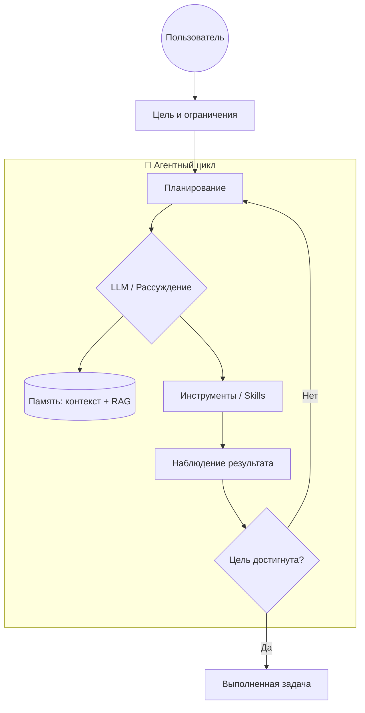

---
tags:
  - agents
  - architecture
  - theory
aliases:
  - Состав агента
  - Agent Anatomy
created: 2026-04-15
---

# 🧠 Анатомия Агента

> [!abstract] Краткий обзор
> Рабочий ИИ-агент - это не одна модель, а цикл из четырех компонентов: **LLM, планирование, память и инструменты**. Сила системы появляется в их связке: агент формулирует шаг, выполняет действие, проверяет результат и корректирует следующий ход.

---

## 🏛️ Ключевые идеи
- **LLM - это ядро, но не вся система:** модель рассуждает и выбирает действия, но без памяти и инструментов не может работать устойчиво в длинных задачах.
- **Планирование снижает хаос:** агент декомпозирует цель на шаги, оценивает прогресс и вносит коррекции по ходу выполнения.
- **Память делает работу накопительной:** краткосрочный контекст удерживает текущую сессию, а долгосрочная память возвращает нужные факты между сессиями.
- **Инструменты превращают ответ в результат:** API, код и файловая система позволяют агенту не просто говорить, а реально менять состояние среды.

---

## 💡 Где использовать (Use Cases)
- **Исследование и аналитика:** агент строит план поиска, извлекает данные из источников и выдает сверенный вывод с ссылками.
- **Разработка фич:** модель пишет код, запускает тесты через инструменты, анализирует ошибки и делает итеративные правки.
- **Операционные задачи:** автоматизация рутины (отчетность, обновление заметок, triage задач) с контролем прав доступа.

---

## 🧠 Разбор компонентов

## 1. Мозг (Core LLM)
Центральный управляющий слой, который интерпретирует цель, выбирает тактику и принимает решения.
- **Что важно в 2026:** сильное [[Архитектор Рассуждений|рассуждение]], управляемость через системный промпт, стабильное следование формату.
- **Практика:** лучше средняя модель с хорошим циклом проверки, чем "самая мощная" модель без архитектуры.

## 2. Планирование (Planning)
Механизм, который переводит "сделай X" в последовательность проверяемых шагов.
- **Self-Reflection:** проверка "что сделано / что осталось / где риск".
- **Sub-goal Decomposition:** разбиение сложной цели на подзадачи с явным критерием готовности.
- **Re-plan loop:** пересборка плана, если внешний сигнал (ошибка, новый факт, смена приоритета) изменил условия.

## 3. Память (Memory)
Слой хранения фактов и состояния, чтобы агент работал не "с нуля" в каждом ходе.
- **Краткосрочная память:** текущее окно контекста и рабочие переменные сессии.
- **Долгосрочная память:** внешнее хранилище (например, [[RAG (Retrieval-Augmented Generation)|RAG]]) для повторного использования знаний.
- **Контроль качества:** память должна быть релевантной; шум в retrieval быстро деградирует решения.

## 4. Инструменты (Tools / Skills)
Исполнительный слой, который превращает намерение в действие.
- **Интерфейсы:** API, shell/python, поиск, файловые операции, бизнес-сервисы.
- **Роль в архитектуре:** инструмент вызывается только при явной необходимости и с проверкой результата.
- **Ключевая метрика:** не число подключенных tools, а доля задач, где действие приводит к верифицируемому outcome.

---

## 🏗️ Схема взаимодействия

---

## 🛠️ Практические настройки
1. Зафиксируй критерий успеха задачи до первого действия агента.
2. Вынеси память в явный слой (заметки, БД, RAG), а не в "магический" длинный контекст.
3. Добавь guardrails: ограничения на инструменты, лимиты шагов, чекпоинты на опасных действиях.
4. Логируй ход цикла: план -> действие -> результат -> корректировка.

## 🔗 Связи
- [[_Agentic Systems Index]] - навигация по разделу агентных систем.
- [[Паттерны Агентного Дизайна]] - как реализовать цикл через архитектурные паттерны.
- [[Протоколы Автономности]] - как добавить безопасность, checkpoints и контроль прав.
- [[Архитектор Рассуждений]] - промпт-подход для усиления reasoning слоя.