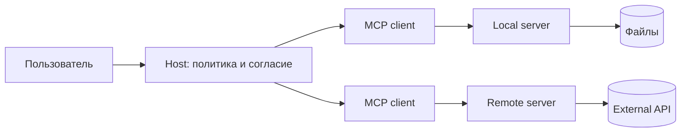

---
tags:
  - mcp
  - architecture
  - protocol
aliases:
  - MCP Architecture
created: 2026-09-14
updated: 2026-09-14
status: time-sensitive
---

# Архитектура MCP

MCP соединяет host-приложение с одним или несколькими серверами через управляемые клиентские соединения. Host остаётся владельцем пользовательского опыта, политик доступа, объединения контекста и вызова модели.

## Участники

- **Host** — AI-приложение: IDE, desktop-клиент, агентная платформа или собственный сервис.
- **Client** — протокольный компонент host, который общается с конкретным сервером.
- **Server** — локальный процесс или удалённый сервис, объявляющий доступные capabilities.
- **Authorization server** — выдаёт токены для защищённого remote server; может быть отдельным от него.

MCP server не является самой моделью и не обязан быть агентом. Он предоставляет стандартизированный интерфейс к возможностям.

## Основные примитивы

| Примитив | Кто предоставляет | Назначение |
|---|---|---|
| Tools | server | действия и вычисления, которые модель может запросить |
| Resources | server | адресуемые данные, доступные для чтения и подписки |
| Prompts | server | переиспользуемые шаблоны взаимодействия |
| Roots | client | допустимые корневые URI, например рабочие папки |
| Sampling | client | запрос server к host на генерацию моделью |
| Elicitation | client | запрос дополнительного ввода или действия пользователя |

Конкретная реализация поддерживает только объявленный набор. Наличие MCP само по себе не означает поддержку всех примитивов.

## Обмен сообщениями

MCP использует JSON-RPC-подобные запросы, ответы и уведомления. Схемы определяют форму данных, а версия протокола — доступную семантику. Tool result остаётся недоверенным содержимым и должен проверяться приложением.

## Transports

### STDIO

Host запускает локальный server как дочерний процесс и общается через standard input/output. Секреты обычно передаются окружением процесса. Важно контролировать пакет, команду запуска, рабочую директорию и права ОС.

### HTTP

Remote server работает как сетевой сервис. Нужны TLS, корректная авторизация, проверка origin и защита от DNS rebinding для локальных endpoint. Способ конфигурации зависит от host и поддерживаемой версии протокола.

## Версии

Версия MCP обозначается датой. Спецификация `2026-07-28` перевела core на stateless request/response модель и убрала обязательный initialization handshake из нового ядра. Старые SDK и servers могут продолжать использовать модель `2025-11-25`, поэтому совместимость нужно проверять, а не предполагать.

## Extensions

Расширения развиваются отдельно от core. Среди актуальных направлений:

- **Tasks** — долгие операции с получением статуса, результата и отменой;
- **MCP Apps** — интерактивные UI-компоненты;
- authorization extensions — дополнительные корпоративные сценарии доступа.

Экспериментальное или поддерживаемое одним host расширение нельзя считать универсальной частью MCP.

## Граница ответственности

Host должен изолировать servers друг от друга и не передавать одному серверу данные другого без необходимости и согласия.

## Источники

- [MCP 2026-07-28 specification](https://modelcontextprotocol.io/specification/2026-07-28)
- [MCP 2026-07-28 release notes](https://blog.modelcontextprotocol.io/posts/2026-07-28/)

См. также: [[Безопасность MCP]], [[Tool Use Function Calling]], [[MCP (Model Context Protocol)]].
